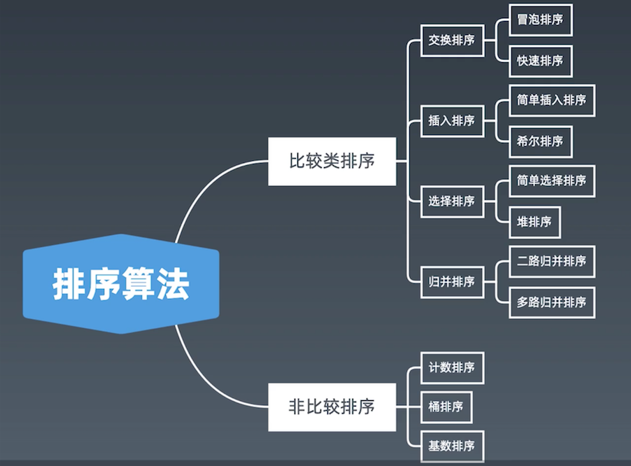

# 解题步骤 (覃超老师)
1、Clarificaiton（了解清楚题目意思及必要的交流）

2、Possible solution -> Optimal (Time & Space)

3、Code （写出最佳解答）

4、Test (多case 测试)

## 心得体会：

```
上周更新
1、国庆假期主要复习了最近一周和之前的一些已做题目


本周更新
1、整理了位运算和排序笔记，重点是归并和快排的笔记和示例代码 （TODO: 位运算笔记）
2、开始练习LeetCode官方的每日一题（坚持刷题和不断的总结，加油！加油！）


```

## Tips:

a、[十大经典排序算法（动图演示）](https://www.cnblogs.com/onepixel/p/7674659.html)
b、[快速排序代码示例](https://shimo.im/docs/TX9bDbSC7C0CR5XO/read)
c、[归并排序代码示例）](https://shimo.im/docs/sDXxjjiKf3gLVVAU/read)
d、[堆排序代码示例](https://shimo.im/docs/M2xfacKvwzAykhz6/read)

### 位运算:
```

```

### 排序算法:

```
1、比较类排序：
通过比较来决定元素间的相对次序（传入comparator），由于其时间复杂度不能突破O(nlogn),因此也称为非线性时间比较类排序
2、非比较类排序：
不通过比较来决定元素间的相对次序，它可以突破基于比较排序的时间下届，比线性时间运算，
因此也称为线性时间非比较类排序（一般对于整型相关的数据类型，并需要额外内存空间作为辅助）
```
```
比较类排序 -> 初级排序-O(n^2)
a、选择排序（Selection Sort -> 简单选择排序、堆排序）
   每次找最小值，然后放到待排序数据的起始位置。
b、插入排序（Insertion Sort -> 简单插入排序、希尔排序）
   从前到后逐步构建有序序列；对于未排序数据，在已排序序列中从后向前扫描，找到相应位置并插入
c、交换排序（Bubble Sort -> 冒泡排序、快速排序）
   嵌套循环，每次查看相邻的元素如果逆序，则交换。
```
```
比较类排序 -> 高级排序-O(nlogn)
a、快速排序（Quick Sort）
   数组取标杆pivot,将小元素放pivot左边，大元素放右边，然后依次对左边和右边的子数组继续快排；以达到整个序列有序。
b、归并排序（Merge Sort）- 分治
  （1、把长度为n的输入序列分成两个长度为n/2的子序列；
  （2、对两个子序列方别采用归并排序；
  （3、将两个排序好的子序列合并成一个最终的排序序列
c、归并和快排具有相似性，但步骤顺序相反
   归并：先排序左右子数组，然后合并两个有序子数组
   快排：先调配出左右子数组，然后对于左右子数组进行排序
d、堆排序（Heap Sort）- 堆插入时间复杂度：O(LogN)，取最大/小值O(1) 
  （1、数组元素依次建立小顶堆
  （2、依次取堆顶元素，并删除
```

 


## 题型记录：
Week08-Day50
朋友圈: leetcode-547
https://leetcode-cn.com/problems/friend-circles/

Week08-Day51
平方数之和: leetcode-633
https://leetcode-cn.com/problems/sum-of-square-numbers/

Week08-Day52
打家劫舍: leetcode-198
https://leetcode-cn.com/problems/house-robber/

Week08-Day53
颠倒二进制位: leetcode-190
https://leetcode-cn.com/problems/reverse-bits/

Week08-Day54
单词接龙 II: leetcode-126
https://leetcode-cn.com/problems/word-ladder-ii/

Week08-Day55
最接近的三数之和: leetcode-16
https://leetcode-cn.com/problems/3sum-closest/

Week08-Day56
最长重复子数组: leetcode-718
https://leetcode-cn.com/problems/maximum-length-of-repeated-subarray/

Week08-Day57
字符串中的第一个唯一字符: leetcode-387
https://leetcode-cn.com/problems/first-unique-character-in-a-string/

Week08-Day58
不同路径: leetcode-62
https://leetcode-cn.com/problems/unique-paths/

Week08-Day59
反转字符串II: leetcode-541
https://leetcode-cn.com/problems/reverse-string-ii/

Week09-Day60
最长上升子序列: leetcode-300
https://leetcode-cn.com/problems/longest-increasing-subsequence/

Week09-Day61
两整数之和: leetcode-371
https://leetcode-cn.com/problems/sum-of-two-integers/


Week09-Day62
验证回文字符串II: leetcode-680
https://leetcode-cn.com/problems/valid-palindrome-ii/

Week09-Day63
最长有效括号: leetcode-32
https://leetcode-cn.com/problems/longest-valid-parentheses/submissions/


